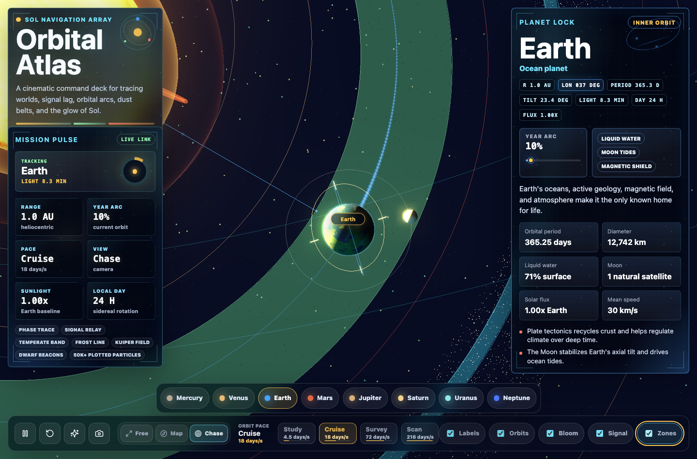
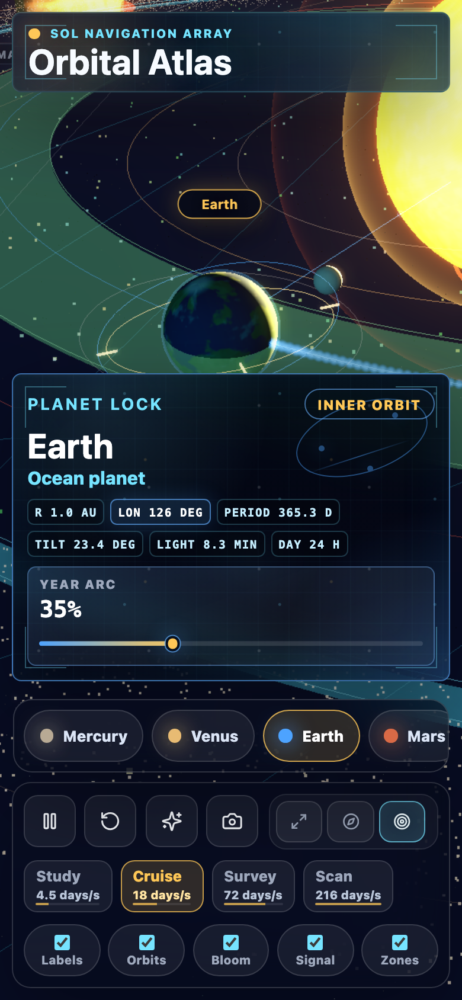

# Orbital Atlas

Orbital Atlas is a cinematic, interactive 3D solar system built with Three.js and Vite. It is designed as a public portfolio project: impressive within the first few seconds, but still easy for a reviewer to inspect, run, test, and deploy.





## Why It Stands Out

- Immediate Earth chase view with smooth camera transitions, planet focus, orbital wake, guide-zone overlays, minor-planet beacons, hover states, guided tour mode, signal links, and an orbit scrubber for rewinding the active planet's year arc.
- Procedural sun, planet, moon-system, atmosphere, ring, asteroid, Kuiper belt, comet, and starfield visuals with no external image licensing burden.
- Recruiter-friendly product surface with concise science facts, live longitude, light-time, sunlight, day-length, orbital-speed readouts, responsive HUD panels, keyboard shortcuts, and exportable scene captures.
- Accessibility and interaction polish including aria state, reduced-motion handling, keyboard planet navigation, touch-friendly controls, and mobile layout checks.
- Automated visual smoke testing that validates desktop and mobile WebGL rendering, core interactions, and horizontal overflow before deployment.

## Tech Stack

- Three.js for the 3D scene, lighting, camera, controls, postprocessing, and procedural materials.
- Vite for local development, production builds, and static GitHub Pages deployment.
- Lucide icons for crisp interface controls.
- Playwright for automated visual verification.

## Quick Start

Requirements:

- Node.js 22 is recommended (`.nvmrc` is included); Node.js 20 or newer is supported
- npm

Install dependencies and start the local app:

```bash
npm ci
npm run dev
```

Open the local URL printed by Vite.

## Review Path

For a fast technical review:

1. Run the app and confirm the Earth chase view loads immediately.
2. Inspect `src/main.js` for the WebGL scene, procedural texture generation, camera state, UI state, and test hooks.
3. Inspect `src/data/solarSystem.js` for the curated planet facts, camera presets, and calibrated scene content.
4. Inspect `src/styles.css` for responsive HUD behavior, mobile layout, and reduced-motion/accessibility polish.
5. Run `npm run public:audit` to check the files that are safe to publish.
6. Run `npm run verify` to audit, build the app, launch a local preview, run the Playwright visual smoke test, and write screenshots to `artifacts/`.
7. Read [docs/PORTFOLIO_BRIEF.md](docs/PORTFOLIO_BRIEF.md) for the project framing and quality bar.

## Verification

```bash
npm run verify
```

The verification command runs the public-safety audit, production build, local Vite preview, desktop and mobile Playwright rendering checks, core interaction checks, and visual artifact capture.

For a fast public-readiness check without launching the browser:

```bash
npm run public:audit
```

For an already-running app, run the visual test directly:

```bash
APP_URL=http://127.0.0.1:5173 npm run visual:test
```

## GitHub Pages

This project is configured with `base: "./"` so the production build works from GitHub Pages project subpaths.

To publish it:

1. Push the repository to GitHub.
2. In repository settings, enable Pages and select GitHub Actions as the source.
3. Keep the `CI` workflow passing on `main`.
4. Run the `Deploy GitHub Pages` workflow manually, or let it deploy automatically after a successful `CI` run on `main`.

## Project Structure

```text
src/main.js              Three.js scene, procedural textures, UI state, controls
src/data/solarSystem.js  Planet facts, camera presets, scene zones, and calibrated content
src/utils/text.js        Shared escaping helper for generated HTML fragments
src/styles.css           Responsive HUD, mobile layout, motion/accessibility polish
scripts/public-audit.mjs Repository hygiene and secret-pattern audit for public release
scripts/visual-check.mjs Playwright rendering and interaction smoke test
scripts/verify.mjs       One-command audit, build, preview, and visual verification
docs/screenshots/        Curated screenshots for the GitHub README
.github/workflows/       CI and GitHub Pages deployment automation
```

## License

MIT License. See [LICENSE](LICENSE).
